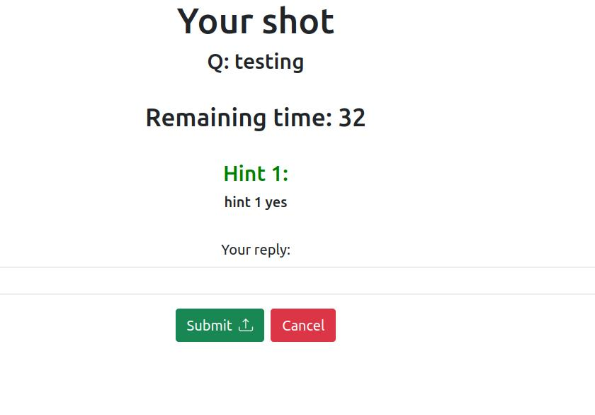

# Exam #2: "SolveMyRiddle"
## Student: s304811 ORMACHEA HERMOZA OMAR ANDRES 

## React Client Application Routes

- Route `/`: Main Route, it will contain the main page containing sidebar, riddle list or top3 list and navbar. 
A user will see in this route only the riddles that he did NOT post
- Route `/top3`: top 3 users list, will consider ties (if multiple users have the highest 3 scores, it will show 
more than 3 users)
- Route `/myriddles`: Will contain ONLY the user's created riddles
- Route `/login`: Login Route, contains only the login form. Will trigger an alert if the credentials are not found
- Route `/riddles/:riddleID`: Dedicated Route for a riddle that is NOT created by the currently logged user, whose id is the parameter :riddleID. The conditions for display will be checked inside this route (wether it is open/closed), the time remaining, hints or form (for submitting an answer) will be shown.
- Route `/myriddles/:riddleID`: Same as above, but for the riddles that the current logged user didn't create.
- Route `/new`: Riddle form (for a New riddle).

## API Server

- POST `/api/login`
  - req parameters: None
  - req body content: username and password (will be used by Passport)
  - res content: session (contains user, name, email)
- P `/api/login`
  - req parameters: None
  - req body content: username and password (will be used by Passport)
  - res content: session (contains user, name, email)
- GET `/api/sessions/current`
  - req parameters: None
  - req body content: session
  - res content: session
- GET `/api/riddles/users/current/others`
  - req parameters: None
  - req body content: session
  - res content: Riddle objects not created by current user 
- GET `/api/riddles/users/current/mine`
  - req parameters: None
  - req body content: session
  - res content: Riddle objects created by current user 
- GET `/api/riddles`
  - req parameters: None
  - req body content: None
  - res content: Riddle objects (All)
- GET `/api/riddles/open/started`
  - req parameters: None
  - req body content: None
  - res content: Riddle objects ("Started" meaning with a defined endTime and open)
- GET `/api/riddles/:id/replies`
  - req parameters: ID of a riddle whose replies will be retrieved
  - req body content: session
  - res content: Reply objects of a given riddle
- GET `/api/replies/current`
  - req parameters: None
  - req body content: session
  - res content: Riddle IDs of the riddles that the logged user has attempted (inserted reply)
- GET `/api/top3`
  - req parameters: None
  - req body content: None
  - res content: Top 3 list of Users objects (contains all data except credentials) (with score)
- GET `/api/users/current/score`
  - req parameters: None
  - req body content: session
  - res content: Score of the current logged in user
- POST `/api/riddles`
  - req parameters: None
  - req body content: Riddle JSON Object (containing only fields provided by the form), session
  - res content: None
- POST `/api/riddles/:id/reply`
  - req parameters: ID of the Riddle which Reply will be inserted on DB 
  - req body content: Reply JSON Object, session
  - res content: None
- PUT `/api/users/current/score`
  - req parameters: None
  - req body content: integer value newScore, session 
  - res content: None
- PUT `/api/riddles/:id/endtime`
  - req parameters: ID of Riddle which endTime will be set
  - req body content: dayjs object casted to string, session
  - res content: None
- PUT `/api/riddles/:id/state`
  - req parameters: ID of Riddle which state will be set to "Closed"
  - req body content: session
  - res content: None
- PUT `/api/riddles/:id/winner`
  - req parameters: ID of Riddle which winner user ID and name will be set
  - req body content: session
  - res content: None
- DELETE `/api/logout`
  - req parameters: None
  - req body content: session
  - res content: None

## Database Tables

- Table `riddles` - contains id, question, difficulty, state, duration, endtime, hint1, hint2, answer, user, winnerid, winnername
- Table `replies` - contains id, riddleid, userid, reply
- Table `users` - contains id, email, name, score, hash, salt 

## Main React Components

- `NavBar` (in `navbar.js`): navbar containing logo, login and logout buttons
- `SideBar`(in `sidebar.js`): sidebar contatining currently logged user, points and 3 options (implemented as "filters") (Riddles, Top 3, My Riddles)
- `RiddleList` (in `riddleList.js`): component that renders the list of riddles according to specifications (rendered by "Riddles" and "My Riddles"), contains the "New Riddle" button when the "My Riddles" option is active
- `RiddleRow` (in `riddleList.js`): component that renders a row for each entry of the riddle list (actually a table). Contains a button that is rendered differently according to wether it's your own riddle or not. Also, becomes disabled if the user has already attempted this riddle (when the riddle gets closed for whatever reason). It will allow viewing the riddle (closed) even if the user attempted before.
- `RiddleForm` (in `riddleForms.js`): component for inserting a new Reply of a Riddle
- `NewRiddleForm` (in `riddleForms.js`): component for inserting a new Riddle
- `Top3List` (in `top3List.js`): component rendering the table showing top 3 users

## Screenshot

## Users Credentials

- omarbola1@polito.it, password
- testuser@polito.it, password
- elmeroloco@polito.it, password
- juan@juanes.pe, password
- pierclaudia@polito.it password
- elbicho@bicho.siu, password
